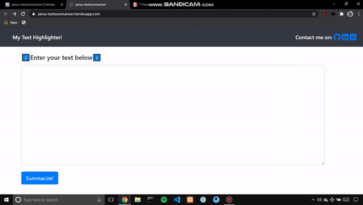

# NLP Text Summarizer 💻📝

### This is a NLP project for Text Summarization which is built with Flask(RESTapi) and deployed on Heroku(PaaS) using NLTK for summarizing text. Here this app takes your huge paragraphs and gives out the only repeating sentences which are important for you.

#### Try Out yourself and link for it:
#### https://jairus-textsummarizer.herokuapp.com/

⚠Dont forget to give your feedback, after using it⚠.

#### Some Glimpse of it😁!

